# SmartTable Service

A restaurant management Android application built with Kotlin and Firebase. SmartTable digitizes the order and table management workflow for restaurant staff — managers, waiters, and kitchen prep cooks each get a tailored dashboard for their role.

---

## Screenshots

### Authentication
| Login | Register |
|---|---|
| 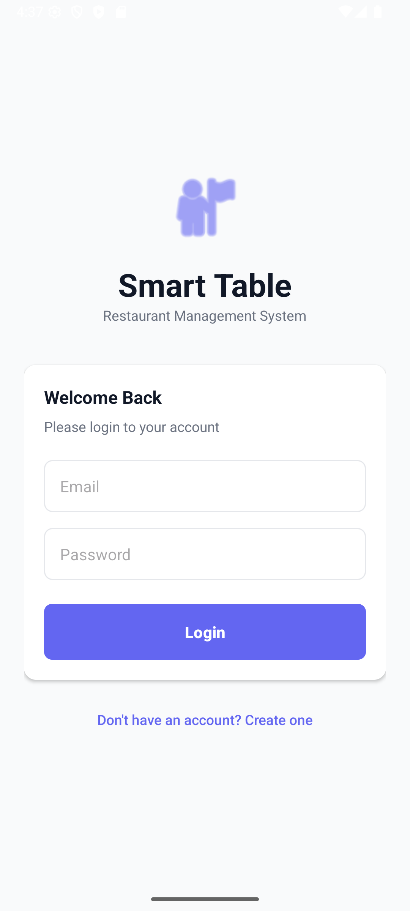 | 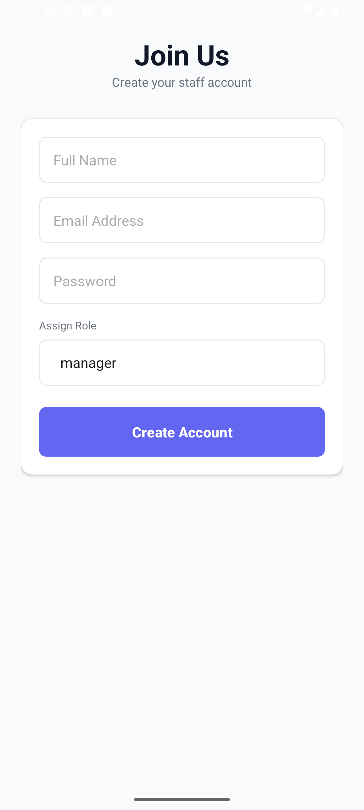 |

### Manager
| Dashboard | Manage Menu | Manage Tables | Staff Management |
|---|---|---|---|
| 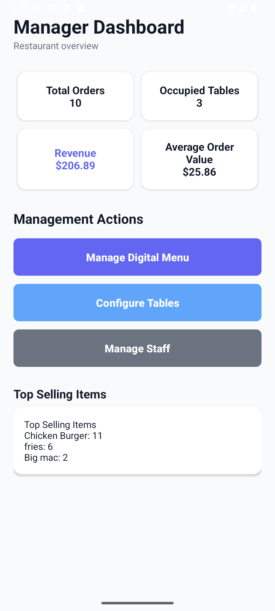 | 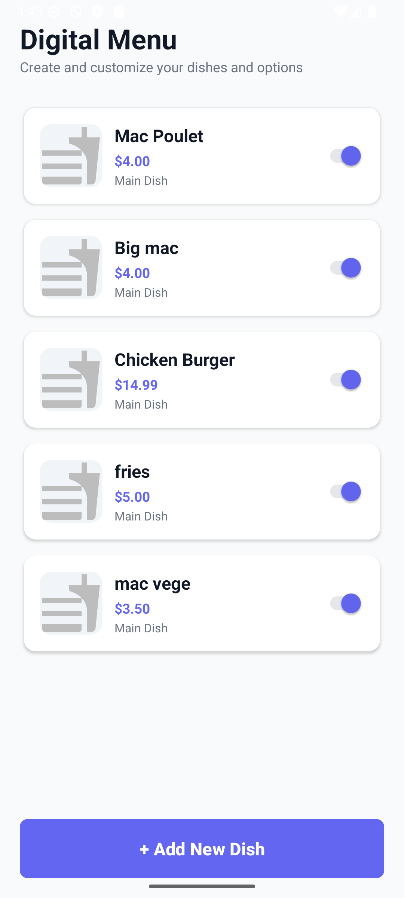 | 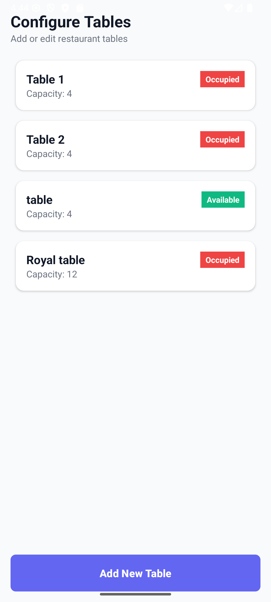 | 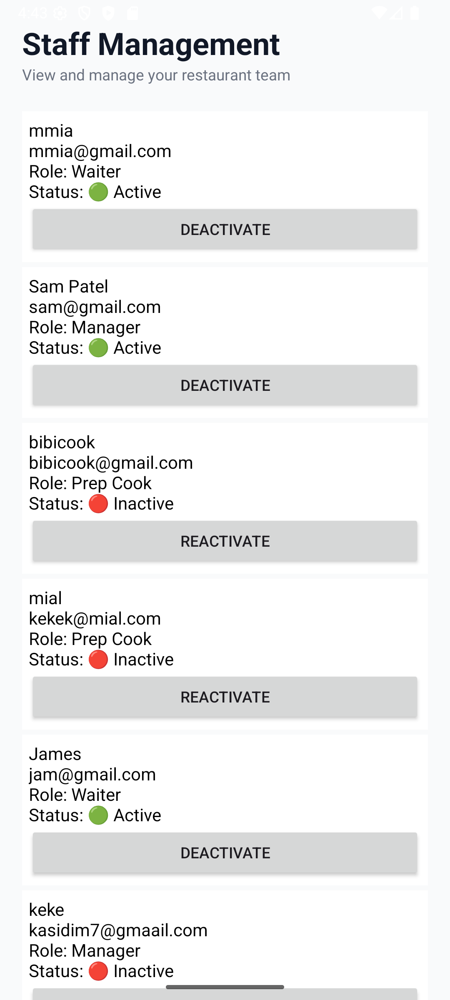 |

### Waiter
| Dashboard | Create Order | Payment |
|---|---|---|
| 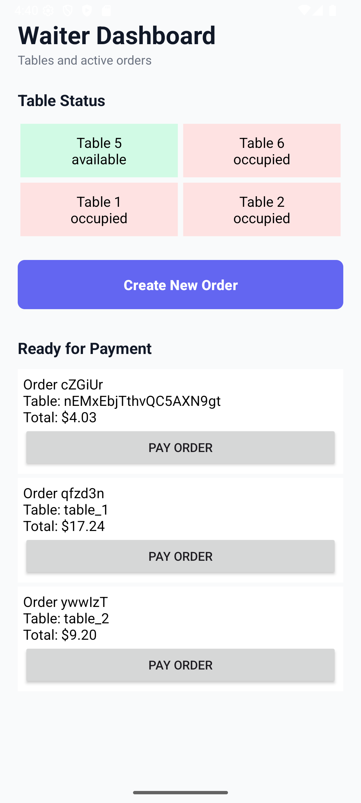 | 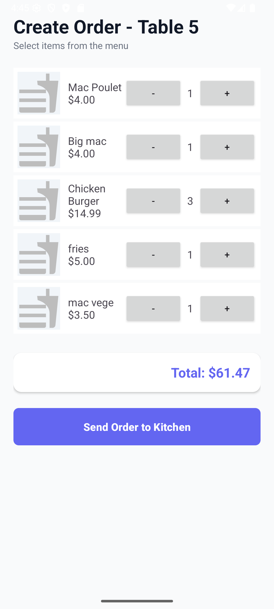 | 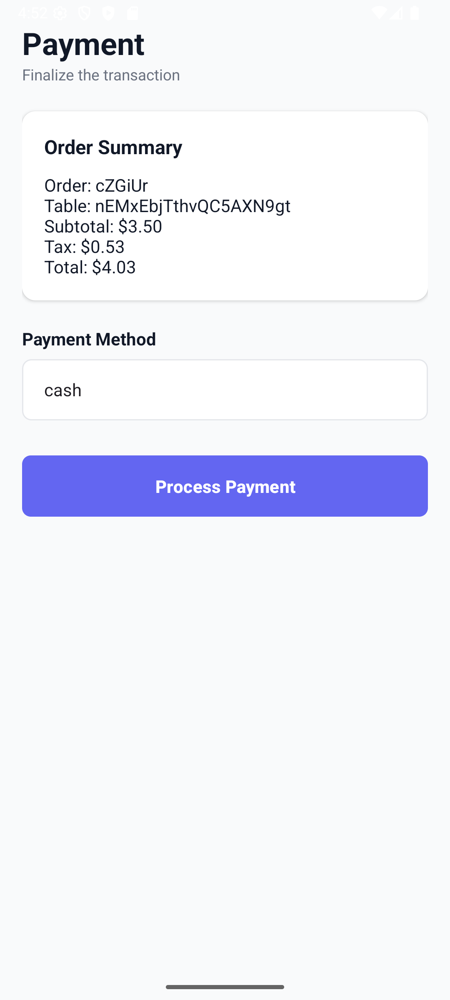 |

### Kitchen
| No Orders | Active Order |
|---|---|
| 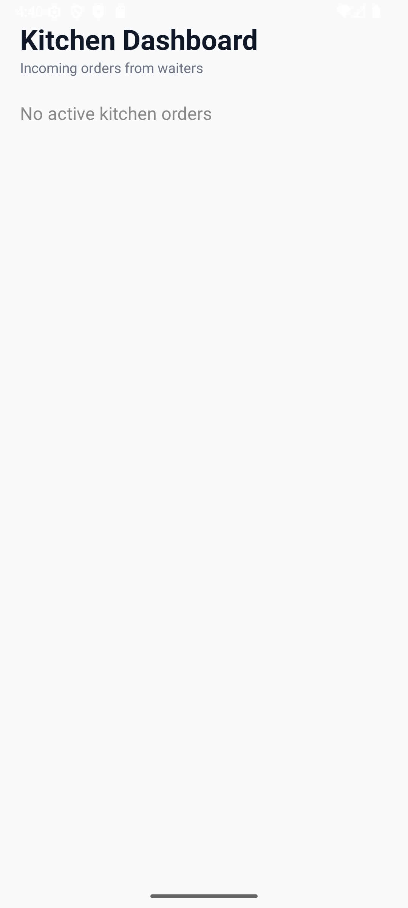 | 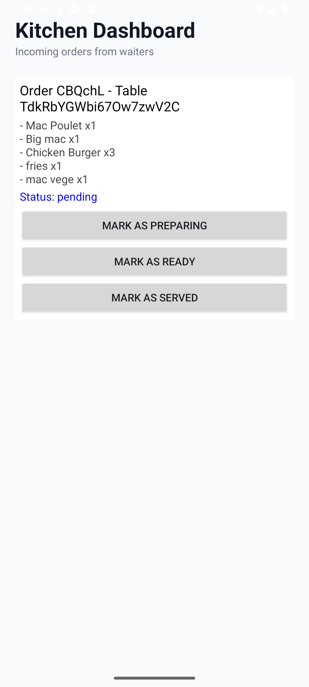 |

---

## Features Implemented

### Authentication & Role Routing
- Staff login and registration via Firebase Authentication
- On login, users are automatically routed to the correct dashboard based on their role (`manager`, `waiter`, `prepCook`)

### Manager Dashboard
- Live statistics: total orders, occupied tables, revenue, average order value, taxes, tips
- Payment breakdown by method (cash, card, online)
- Top 3 selling menu items
- Navigation to Staff Management, Menu Management, and Table Management

### Staff Management
- View and manage all staff accounts
- Roles: `manager`, `waiter`, `prepCook`
- Toggle staff active/inactive status

### Menu Management
- Add, edit, and delete menu items
- Fields: name, description, price, category, availability
- Customization options (add-ons) per item — extras or removals with individual pricing
- Image picker prepared for future Firebase Storage integration (placeholder shown when no image is set)
- Toggle item availability without opening the edit dialog

### Table Management
- Add and manage restaurant tables
- Table statuses: `available`, `occupied`, `reserved`, `cleaning`

### Waiter Dashboard
- Visual table grid with colour-coded status indicators
- Select an available table and create a new order
- View orders with status `served` and initiate payment

### Create Order
- Browse available menu items with name, price, and image (placeholder if none set)
- Increment/decrement item quantities
- Running order total calculated in real time
- Order submitted to Firestore and table status set to `occupied`

### Kitchen Dashboard
- Real-time order feed via Firestore snapshot listener — updates instantly without refresh
- Each order card shows: order ID, table, item list with quantities, and current status
- Kitchen staff can advance order status: `pending` → `preparing` → `ready` → `served`

### Payment
- Payment screen loads order details (subtotal, tax, total)
- Payment method selection: cash, card, online
- On completion: payment recorded, order marked `paid`, table reset to `available`

---

## Project Architecture

```
app/src/main/java/com/moses/smarttableservice/
│
├── activities/          # One Activity per screen
│   ├── SplashActivity
│   ├── LoginActivity
│   ├── RegisterActivity
│   ├── ManagerDashboardActivity
│   ├── WaiterDashboardActivity
│   ├── KitchenDashboardActivity
│   ├── ManageMenuActivity
│   ├── ManageTablesActivity
│   ├── StaffManagementActivity
│   ├── CreateOrderActivity
│   └── PaymentActivity
│
├── adapters/            # RecyclerView adapters
│   ├── MenuItemAdapter
│   ├── OrderAdapter
│   └── TableAdapter
│
├── models/              # Firestore data models
│   ├── User
│   ├── MenuItem
│   ├── AddOn
│   ├── Order
│   ├── OrderItem
│   ├── RestaurantTable
│   └── Payment
│
├── repositories/        # All Firestore read/write logic
│   ├── AuthRepository
│   ├── MenuRepository
│   ├── OrderRepository
│   ├── PaymentRepository
│   ├── TableRepository
│   └── UserRepository
│
├── services/            # Business logic layer
│   ├── RoleRouterService   # Routes user to correct dashboard by role
│   ├── OrderStatusService  # Order status helpers
│   └── StatisticsService   # Dashboard stats aggregation
│
└── utils/
    ├── FirebaseCollections  # Firestore collection name constants
    └── Constants
```

**Pattern:** Activities talk to Repositories; Repositories talk to Firebase. No business logic lives in Activities beyond UI handling.

---

## Firebase Collections

### `users`
Stores all staff accounts.

| Field | Type | Description |
|---|---|---|
| `userId` | String | Firebase Auth UID |
| `name` | String | Full name |
| `email` | String | Email address |
| `phone` | String | Phone number |
| `role` | String | `manager`, `waiter`, or `prepCook` |
| `isActive` | Boolean | Whether the account is active |
| `createdAt` | Long | Unix timestamp |

### `menuItems`
All dishes on the restaurant menu.

| Field | Type | Description |
|---|---|---|
| `itemId` | String | Auto-generated document ID |
| `name` | String | Dish name |
| `description` | String | Dish description |
| `price` | Double | Price in dollars |
| `category` | String | e.g. Mains, Drinks, Desserts |
| `imageUrl` | String | Firebase Storage URL (empty until Storage is enabled) |
| `isAvailable` | Boolean | Whether the item is on the active menu |
| `addOns` | Array | List of `AddOn` objects |

**AddOn sub-object:**

| Field | Type | Description |
|---|---|---|
| `name` | String | Add-on label |
| `price` | Double | Additional cost (negative = removal discount) |
| `type` | String | `extra` or `remove` |
| `isAvailable` | Boolean | Whether this option is active |

### `orders`

| Field | Type | Description |
|---|---|---|
| `orderId` | String | Auto-generated document ID |
| `tableId` | String | Reference to the table |
| `waiterId` | String | Firebase Auth UID of the waiter |
| `orderType` | String | `dine_in` |
| `status` | String | `pending` → `preparing` → `ready` → `served` → `paid` |
| `items` | Array | List of `OrderItem` objects |
| `subtotal` | Double | Before tax |
| `taxAmount` | Double | 15% of subtotal |
| `discountAmount` | Double | Any applied discount |
| `total` | Double | Final amount |
| `notes` | String | Optional order notes |
| `createdAt` | Long | Unix timestamp |
| `updatedAt` | Long | Unix timestamp |

**OrderItem sub-object:**

| Field | Type | Description |
|---|---|---|
| `itemId` | String | Reference to `menuItems` document |
| `name` | String | Snapshot of item name at time of order |
| `quantity` | Int | Number ordered |
| `unitPrice` | Double | Price at time of order |
| `selectedAddOns` | Array | Chosen add-ons |
| `notes` | String | Per-item notes |
| `kitchenStatus` | String | `pending`, `preparing`, `ready` |

### `tables`

| Field | Type | Description |
|---|---|---|
| `tableId` | String | Auto-generated document ID |
| `tableNumber` | Int | Display number |
| `name` | String | Optional table label |
| `capacity` | Int | Max seats |
| `status` | String | `available`, `occupied`, `reserved`, `cleaning` |
| `currentOrderId` | String? | Active order ID if occupied |
| `assignedWaiterId` | String? | Assigned waiter UID |

### `payments`

| Field | Type | Description |
|---|---|---|
| `paymentId` | String | Auto-generated document ID |
| `orderId` | String | Reference to the order |
| `tableId` | String | Reference to the table |
| `amountPaid` | Double | Total charged |
| `subtotal` | Double | Before tax |
| `taxAmount` | Double | Tax portion |
| `tipAmount` | Double | Tip (default 0) |
| `paymentMethod` | String | `cash`, `card`, or `online` |
| `status` | String | `paid` |
| `createdAt` | Long | Unix timestamp |

### `notifications` / `restaurantSettings`
Collections reserved for future use.

---

## Firebase Storage Structure

> Firebase Storage integration is prepared but not yet active (requires Blaze plan). The `imageUrl` field on `MenuItem` is ready to store the URL once enabled.

Planned structure:
```
menu_images/
└── {itemId}.jpg     # One image per menu item, overwritten on update
```

---

## User Workflows

### Manager
1. Log in → routed to Manager Dashboard
2. View live stats (orders, revenue, occupied tables, top items)
3. Navigate to **Manage Menu** → add/edit/delete dishes and customization options
4. Navigate to **Manage Tables** → add/configure tables
5. Navigate to **Staff Management** → view and manage staff accounts

### Waiter
1. Log in → routed to Waiter Dashboard
2. View colour-coded table grid (green = available, red = occupied, yellow = reserved, blue = cleaning)
3. Tap an available table → tap **Create Order**
4. Select menu items and quantities → submit order (sent to kitchen, table marked occupied)
5. When an order appears in the "Ready for Payment" section, tap **Pay Order**
6. Select payment method → confirm → table resets to available

### Prep Cook (Kitchen)
1. Log in → routed to Kitchen Dashboard
2. Dashboard listens in real time — new orders appear automatically
3. For each order, advance status: **Mark as Preparing** → **Mark as Ready** → **Mark as Served**

---

## Setup Instructions

### Prerequisites
- Android Studio Hedgehog or later
- Android SDK 30+
- A Firebase project

### Running the App
1. Clone the repository
2. Open in Android Studio
3. Add your `google-services.json` to `app/` (required — the app will not compile without it)
4. Sync Gradle (`File → Sync Project with Gradle Files`)
5. Run on a device or emulator (API 30+)

### Creating Accounts
Register through the app and select a role (manager, waiter, or prep cook) from the dropdown. Subsequent staff accounts can be created the same way or from the Staff Management screen.

---

## Tech Stack

| | |
|---|---|
| Language | Kotlin |
| Platform | Android (min SDK 30) |
| Database | Firebase Firestore |
| Authentication | Firebase Authentication |
| Image Storage | Firebase Storage *(prepared, not yet active)* |
| Image Loading | Glide 4.16.0 |
| Architecture | Activity → Repository → Firebase |
